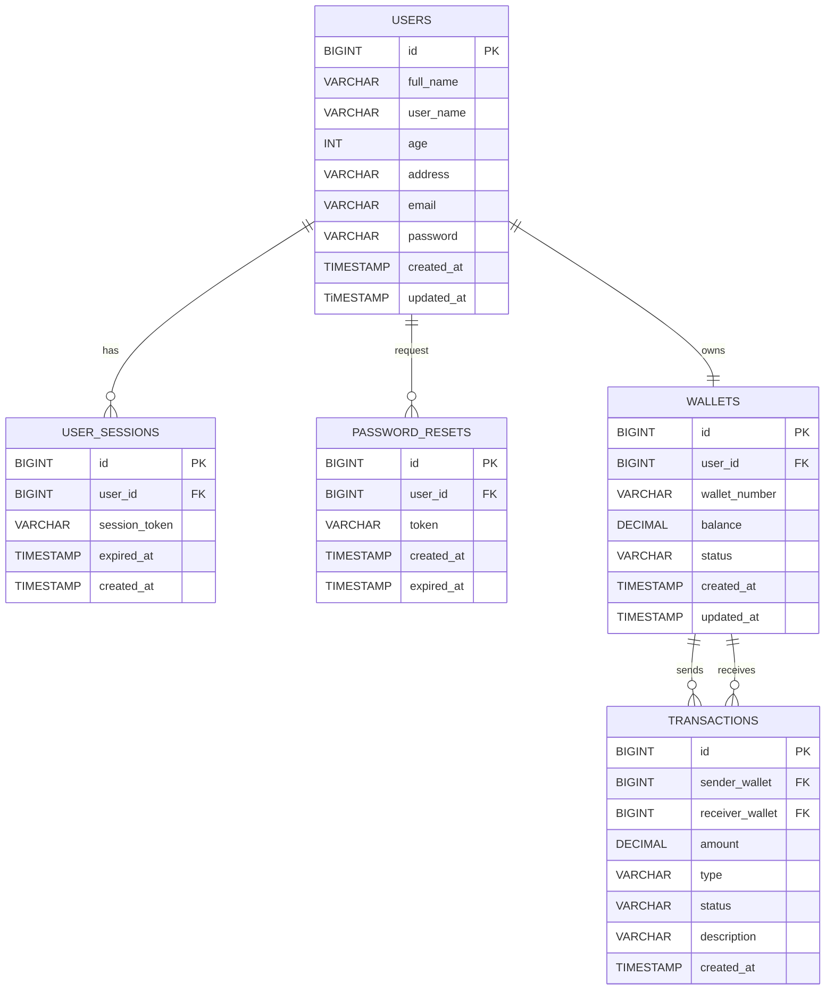

# ERD E-wallet CLI

```mermaid

erDiagram

USERS ||--o{USER_SESSIONS: has
USERS ||--o{PASSWORD_RESETS: request
USERS ||--|| WALLETS : owns
WALLETS ||--o{TRANSACTIONS : sends
WALLETS ||--o{TRANSACTIONS : receives


USERS{
    BIGINT id PK
    VARCHAR full_name
    VARCHAR user_name 
    INT age
    VARCHAR address
    VARCHAR email
    VARCHAR password
    TIMESTAMP created_at
    TiMESTAMP updated_at
}

USER_SESSIONS{
    BIGINT id PK
    BIGINT user_id FK
    VARCHAR session_token 
    TIMESTAMP expired_at
    TIMESTAMP created_at 
}

WALLETS{
    BIGINT id PK
    BIGINT user_id FK
    VARCHAR wallet_number 
    DECIMAL balance
    VARCHAR status
    TIMESTAMP created_at
    TIMESTAMP updated_at
}

TRANSACTIONS{
    BIGINT id PK
    BIGINT sender_wallet FK
    BIGINT receiver_wallet FK
    DECIMAL amount
    VARCHAR type
    VARCHAR status
    VARCHAR description
    TIMESTAMP created_at
}

PASSWORD_RESETS{
    BIGINT id PK
    BIGINT user_id FK
    VARCHAR token
    TIMESTAMP created_at
    TIMESTAMP expired_at
}
```